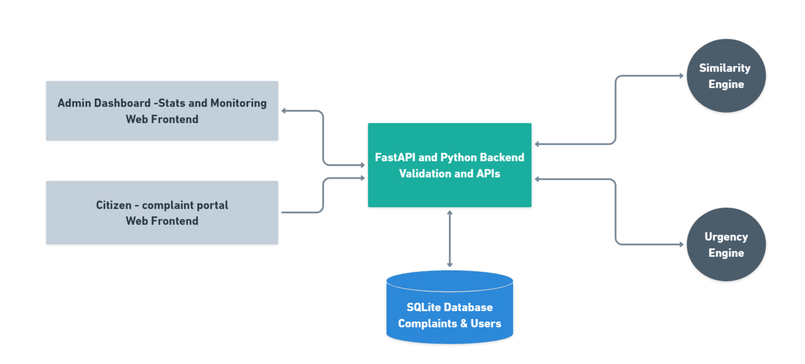
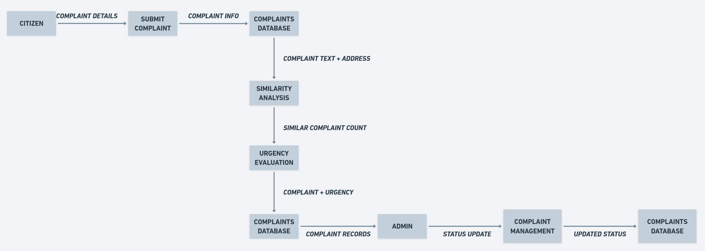
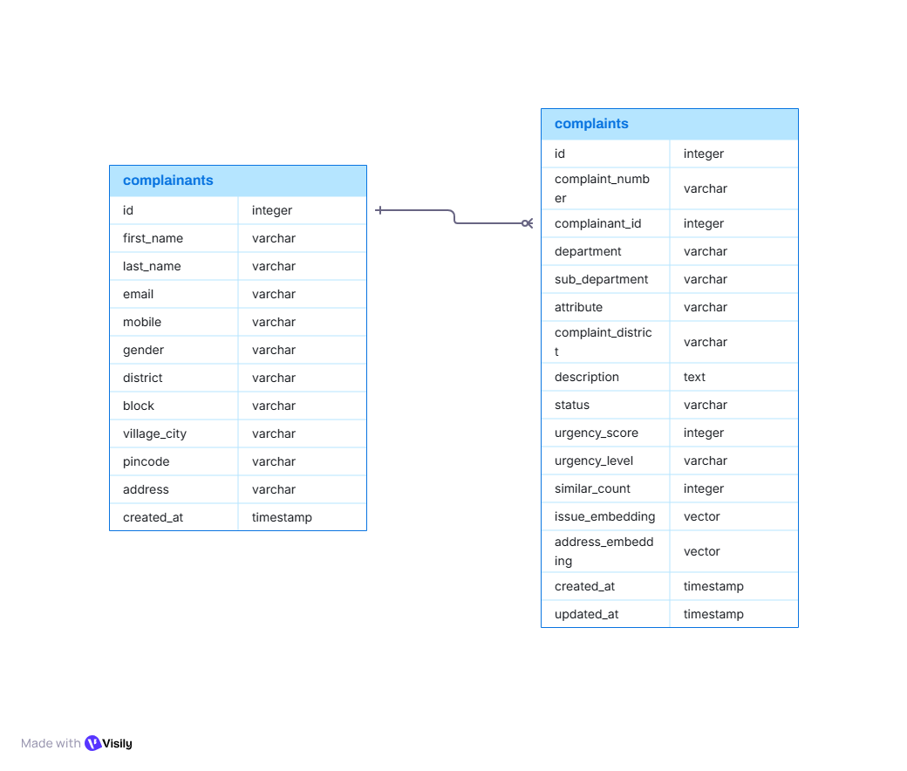
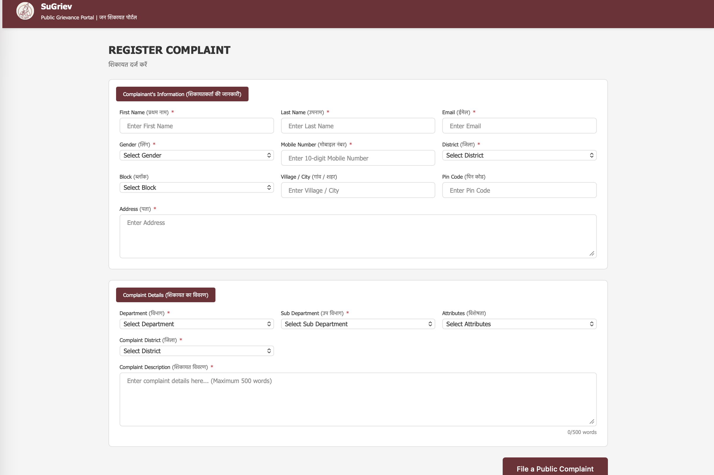
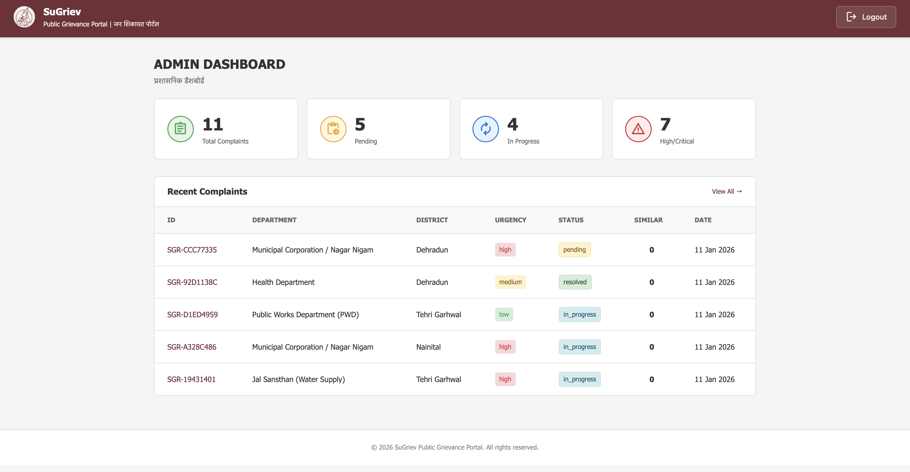
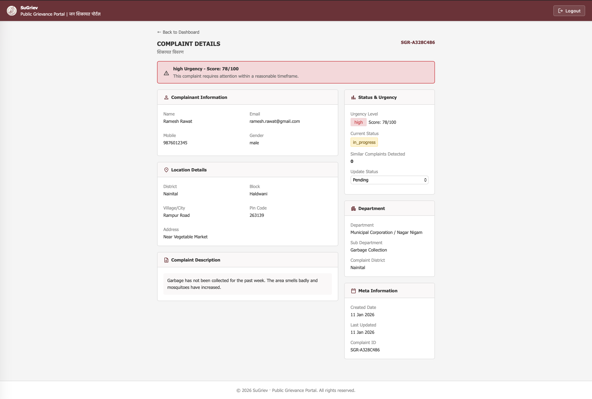
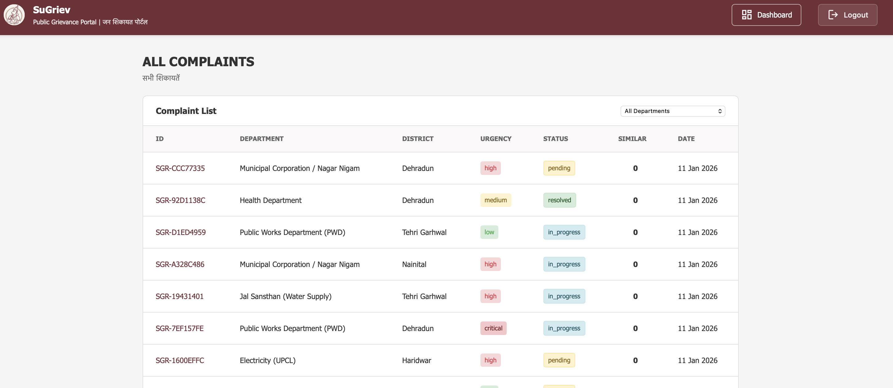

# SuGriev – Round 2: System Design & Implementation

## 1. Project Overview
Note: for Better context check README_ROUND_1.md before jumping to this file.

*SuGriev* is a Public Grievance Prioritization System designed to solve a very common but critical problem in existing grievance portals — lack of prioritization and fragmentation across departments.

In most current systems, citizens must visit different portals for different departments, and once a complaint is submitted, all complaints are treated equally. A minor issue and a life-threatening one often sit in the same queue.

In real-world systems, a broken streetlight and a life-threatening open manhole often sit in the same queue. SuGriev changes this by introducing **intelligence into grievance handling**.

### What SuGriev Does
- Provides a **single unified platform** for grievance submission
- Automatically **understands complaint content**
- **Prioritizes complaints** based on urgency, safety risk, and recurrence
- Helps authorities focus on **what matters most, first**

The system doesn’t just store complaints — it **analyzes and ranks them**.

---

## 2. Core Idea & Logic

SuGriev is built on two key ideas:

### 🔹 Complaint Understanding
Each complaint is converted into **semantic embeddings**, allowing the system to:
- Detect duplicate or recurring complaints
- Understand context beyond keywords
- Avoid treating the same issue as multiple unrelated problems

### 🔹 Intelligent Prioritization
Every complaint receives an **urgency score (0–100)** based on:
- Severity of the issue
- Public safety risks
- Sensitive locations (schools, hospitals, anganwadis)
- Recurring complaints in the same locality

This ensures **critical issues are surfaced immediately**.

---

## 3. Technology Stack

### Backend (Python)
- **FastAPI** – High-performance API framework
- **Uvicorn** – ASGI server
- **SQLite** – Lightweight relational database
- **Raw SQL queries** (no ORM) for transparency and control

### AI / Machine Learning
- **sentence-transformers**
  - Model: `paraphrase-MiniLM-L12-v2`
- **torch** – Model backend
- **numpy** & **scikit-learn**
  - Vector operations
  - Cosine similarity

### Data Validation
- **Pydantic**
- **email-validator**

### Frontend (Prototype)
- HTML5, CSS3, Vanilla JavaScript
- No frontend framework
- Clean government-portal-style UI
- Multi-page architecture

---

## 4. System Architecture

SuGriev follows a **Monolithic Client–Server Architecture** with clear separation between frontend and backend logic.

### High-Level Flow
1. Citizen submits a complaint via the web interface
2. Frontend sends structured JSON to the backend
3. Backend processes complaint using:
   - Similarity Engine
   - Urgency Engine
4. Complaint data, embeddings, and scores are stored
5. Admin accesses prioritized complaints via dashboard APIs

---

## 4.1 High-Level System Architecture Diagram

📌 **File:** `HIGHLEVEL.png`



---

## 4.2 Data Flow Diagram (DFD)

📌 **File:** `DFD.png`



---

## 5. Database Design (ER Diagram)

📌 **File:** `sugriev_er_diagram.png`



---

## 6. Codebase Structure
```
SuGriev/
├── main.py                     # FastAPI entry point, API routes & orchestration
├── database.py                 # SQLite schema, queries, dashboard stats
├── db_test.py                  # Standalone DB testing & sample data insertion
├── similarity_engine.py        # Semantic similarity detection using embeddings
├── urgency_engine.py           # Rule-based urgency scoring system
├── sugriev.db                  # SQLite database (demo/testing)
├── requirements.txt            # Backend dependencies
│
├── SuGriev_frontend/           # Frontend prototype (Vanilla JS)
│   ├── assets                  # Images, icons, static frontend assets
│   ├── index.html              # Landing page
│   ├── register.html           # Complaint registration form
│   ├── admin_login.html        # Admin login page
│   ├── dashboard.html          # Admin dashboard view
│   ├── all_complaints.html     # View all complaints
│   ├── detail.html             # Complaint detail page
│   ├── app.js                  # Frontend DOM logic & event handling
│   ├── api.js                  # API communication layer
│   ├── config.js               # API base URLs & config
│   └── styles.css              # UI styling (government-portal theme)
│
├── README.md                   # Round 1 documentation
└── README_Round2.md            # Round 2 system design & implementation
```
Each module is intentionally independent to keep the system clean and testable.

---

## 7. Key System Components

### A. Similarity Engine (`similarity_engine.py`)
- Uses **semantic embeddings**
- Filters complaints by **same pincode**
- Computes cosine similarity on:
  - Issue text embeddings
  - Address embeddings
- Prevents duplication and detects recurring issues

---

### B. Urgency Engine (`urgency_engine.py`)

Urgency score is calculated using a weighted, rule-based approach.

#### Factors Considered
- **Issue Severity:** fire, explosion, electric shock, open manhole
- **Location Sensitivity:** school, hospital, anganwadi
- **Recurrence:** multiple similar complaints
- **Time Factor:** older unresolved complaints gain weight
- **Community Impact:** entire locality vs single household

#### Urgency Levels
- **Critical:** ≥ 85
- **High:** ≥ 60
- **Medium:** ≥ 40
- **Low:** < 40

---

## 8. Admin Workflow

- Admin login (prototype-based)
- View all complaints ordered by urgency
- View complaint details
- Update complaint status
- Track `updated_at` timestamps

This mirrors real-world government grievance handling systems.

---

## 9. Frontend Screenshots (Prototype)

### Frontend Flow (Ordered)

#### 1 Complaint Registration


#### 2 Admin Login


#### 3 Admin Dashboard


#### 4 Complaint Details View


#### 5 All Complaint View


---

## 10. Scalability & Future Improvements

Although SuGriev is a prototype, the system is designed to scale.

### Planned Enhancements
1. **Vector Database** – pgvector / FAISS
2. **Async DB Layer** – aiosqlite / PostgreSQL
3. **Frontend Framework** – React / Vue
4. **Authentication** – Role-based access
5. **Analytics Dashboard** – Resolution time & department metrics

---

## 11. Team Contributions

| Team Member          | Responsibility          |
|---------------------|-------------------------|
| **Ashutosh Rauthan**| Backend APIs & Integration |
| **Aditya Pharswan** | Frontend Development    |
| **Arpan Sharma**    | Database Design & Queries |
| **Amol Kainthola**  | AI / ML (Similarity & Urgency Logic) |

All contributions are visible through Git commit history and PRs.

---

## 12. AI Usage Disclosure

AI tools were used **only for assistance** in:
- Boilerplate code
- Syntax checks
- Documentation drafting

All architecture, logic, and prioritization decisions were **designed and implemented by the team**.

---

## 13. Conclusion

SuGriev demonstrates how AI can be responsibly applied in governance systems. By combining semantic understanding with transparent rule-based scoring, it ensures that **critical public issues receive attention when they matter most**.

---

### One-Line Summary

> **SuGriev is a unified grievance platform that intelligently detects recurring issues and prioritizes complaints based on real-world urgency and public impact.**
