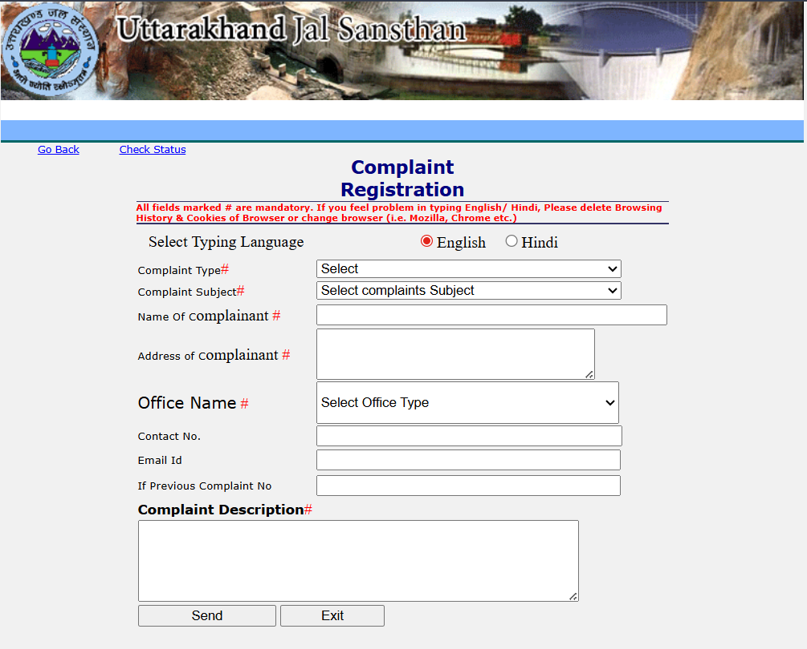
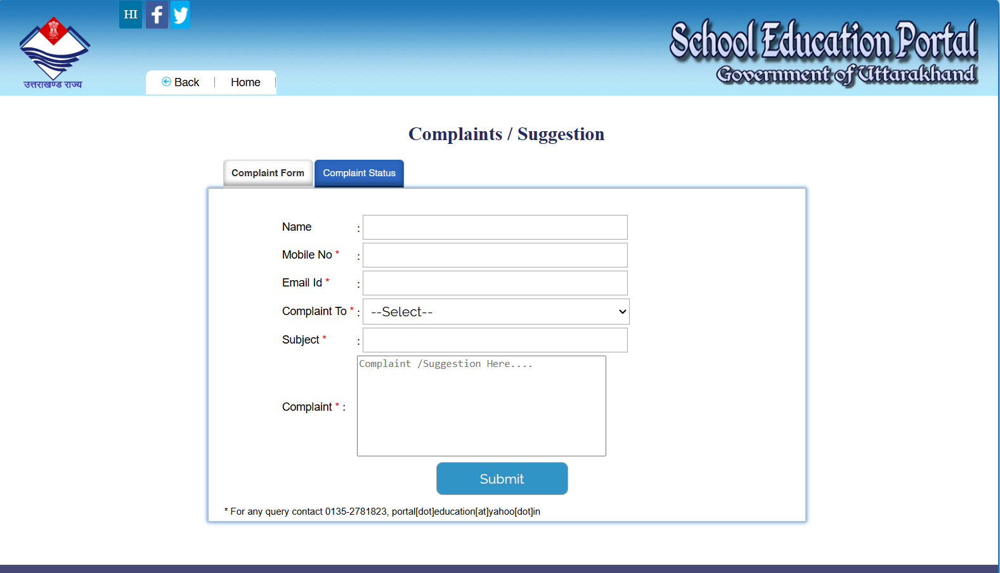
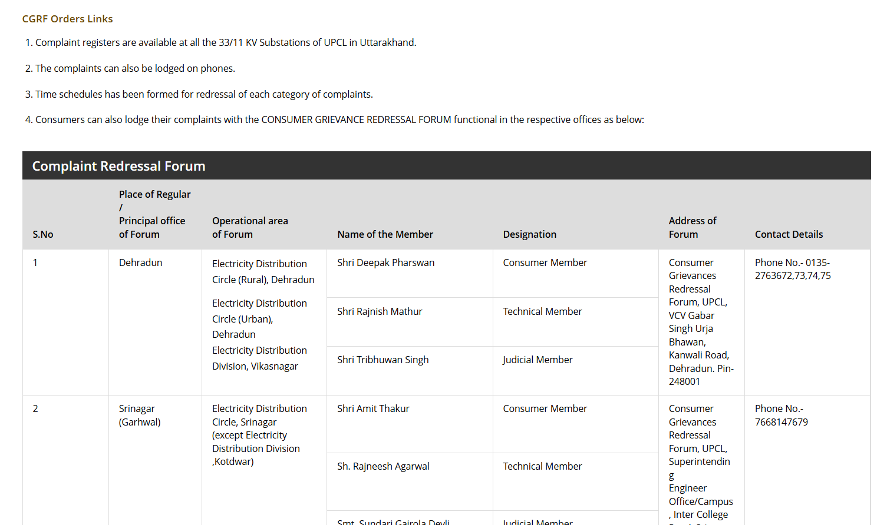
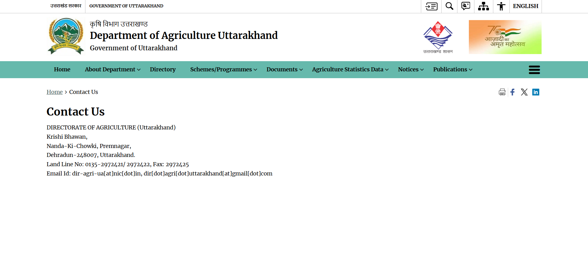
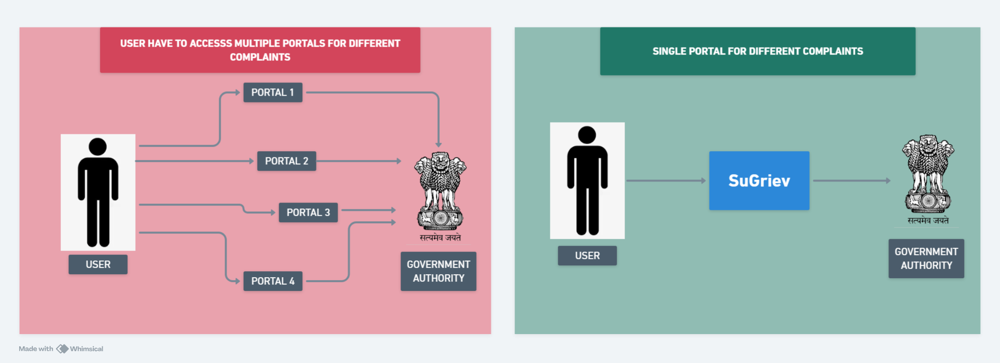
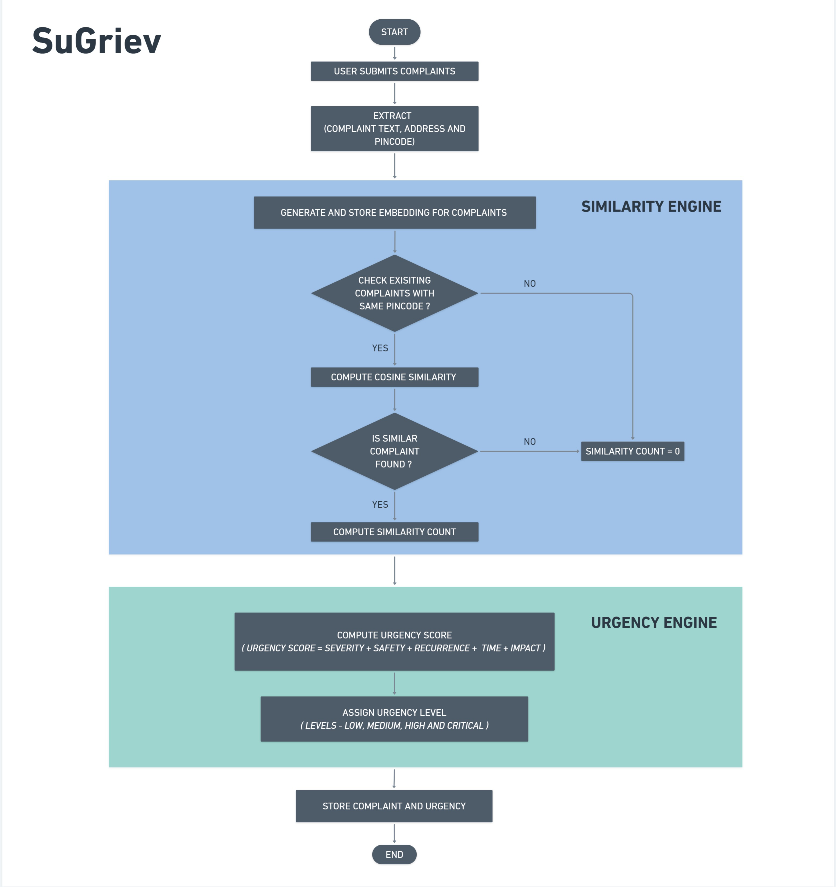
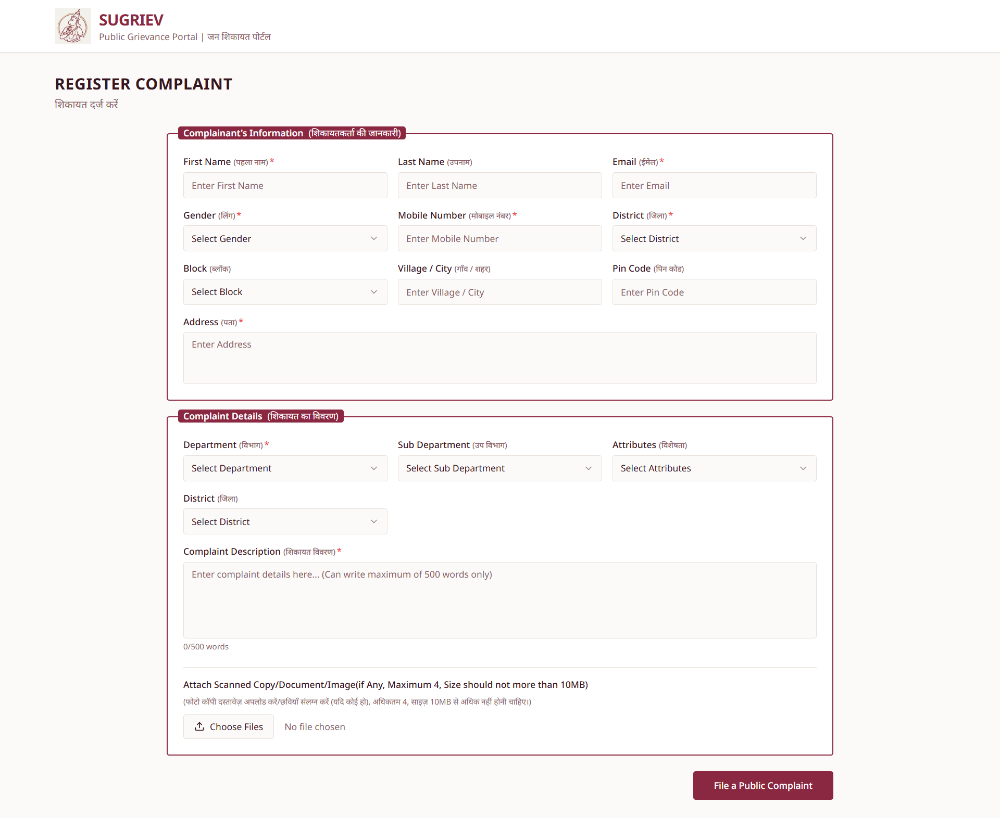

# SuGriev – Public Grievance Prioritization System

---

## 1. Problem Statement

Public grievance systems allow citizens to report issues related to civic services such as roads, water supply, electricity, sanitation, and public safety. However, in the current setup, grievance reporting and handling suffer from two major problems.

First, citizens are required to visit **different portals for different departments** to submit complaints. This creates confusion, increases effort, and discourages people from reporting issues, especially when they are unsure which department is responsible.

Second, once complaints are submitted, most systems **do not evaluate the urgency** of the complaint. All complaints are treated similarly, regardless of whether the issue is minor or poses a serious public safety risk.

Because of these limitations, urgent issues may not receive timely attention, leading to delayed resolution and increased risk.

### Examples of Fragmented Grievance Portals

Below are examples of how citizens currently need to visit multiple portals for different departments:

---

## 2. Why This Solution Is Needed

Without an intelligent prioritization mechanism:

- Citizens must spend time navigating multiple grievance portals  
- Repeated complaints about the same issue are handled separately  
- Authorities must manually decide which complaints need urgent action  
- Critical issues may be overlooked due to lack of urgency indicators  

There is a clear need for a system that:

- Provides a **single platform** for submitting any type of grievance  
- Automatically identifies **which complaints are urgent**  
- Helps departments focus on **high-priority issues first**

---

## 3. Proposed Solution

SuGriev is a **unified grievance submission and prioritization platform** designed to simplify complaint reporting for citizens and improve efficiency for government departments.

From the citizen’s perspective, SuGriev acts as a **single portal** where any grievance can be submitted, without worrying about different departmental portals.

From the department’s perspective, the system:

- Analyzes complaints after submission  
- Calculates an **urgency score**  
- Attaches an **urgency level** to each complaint  

This allows departments to clearly see which complaints require immediate attention and which can be addressed later.

### Existing Systems vs SuGriev (Conceptual Flow)

---

## 4. How the System Works

### Step-by-Step Flow

1. A citizen submits a complaint through the SuGriev platform by providing:
   - Complaint description  
   - Address  
   - Pincode  

2. The system processes and structures the complaint data.

3. A semantic embedding is generated for the complaint and stored.

4. Existing complaints from the **same pincode** are retrieved.

5. Cosine similarity is used to compare the new complaint with existing complaints.

6. A similarity count is calculated to identify recurring issues at the same location.

7. An urgency score is computed using multiple factors such as:
   - Severity of the issue  
   - Public safety relevance  
   - Recurrence of similar complaints  
   - Time elapsed since submission  
   - Inferred impact from complaint text and address  

8. Based on the urgency score, the complaint is assigned an urgency level:
   - Low  
   - Medium  
   - High  
   - Critical  

9. The complaint, along with its urgency score and level, is forwarded to the appropriate department for action.

### Internal Working Flow of SuGriev

---
## Example Scenarios

The following examples illustrate how SuGriev works in real-world situations.

---

### Example 1: Recurring Public Safety Issue

**Complaint 1**
- Issue: Open manhole near primary school
- Address: Raipur near Government School
- Pincode: 248008

**Complaint 2**
- Issue: Drain cover missing outside school
- Address: Near Government Primary School, Raipur 
- Pincode: 248008

**System Behavior**
- Both complaints belong to the same pincode
- Semantic similarity is high
- Recurrence is detected
- Severity and safety risk are high due to school proximity

**Result**
- High urgency score
- Urgency Level: **HIGH**
- Complaint is prioritized for immediate action

---

### Example 2: Impact-Based Urgency Increase

**Complaint**
- Issue: Contaminated water supply in entire colony
- Address: Residential colony near Anganwadi
- Pincode: 248005

**System Behavior**
- Keywords indicate wide impact ("entire colony")
- Sensitive location detected (Anganwadi)
- Severity and impact scores increase

**Result**
- High urgency score
- Urgency Level: **Critical**
- Complaint is marked for priority handling

---

## Why These Examples Matter

These examples demonstrate that SuGriev:
- Detects recurring complaints only within the same location
- Differentiates between similar and unrelated issues
- Prioritizes public safety and high-impact problems
- Avoids false escalation across different areas

---

## 5. Urgency Calculation Overview

The urgency of a complaint is calculated using a transparent, rule-based approach:
  
  **Urgency Score = Severity + Safety + Recurrence + Time + Impact**

This urgency score helps departments:

- Quickly identify critical complaints  
- Prioritize work efficiently  
- Reduce response time for high-risk issues  

---

## 6. Core Engine Demo Files

The project is organized using separate logic modules to keep the system clear and maintainable:

**similarity_engine.py** – Handles location-aware complaint similarity detection

**urgency_engine.py** – Calculates urgency score and assigns priority level

These modules work together to support complaint prioritization.

---

## 7. Frontend Interface (Prototype)

Below is a prototype of the complaint submission interface designed using Figma:

---

## 8. Key Benefits of the System

- Single platform for submitting all types of complaints  
- No need to navigate multiple department portals  
- Automatic identification of urgent complaints  
- Better workload management for departments  
- Transparent and explainable prioritization  

---

## 9. Conclusion

SuGriev improves public grievance handling by combining a unified submission platform with intelligent urgency assessment. By assigning urgency levels to complaints and forwarding them to the relevant departments, the system helps ensure that critical issues are addressed properly while maintaining transparency and simplicity.

---

> **SuGriev provides a unified grievance platform to the citizens and calculates urgency scores to help departments prioritize and resolve critical complaints efficiently.**

---            
##  Planned Improvements for Round 2 

In Round 2, the focus will shift from research and logic validation to building a more complete and usable system. The following improvements and additions are planned:

### 1. Backend and Frontend Development

We plan to design and implement both the backend and frontend components of the system.  
The backend will handle complaint submission, similarity analysis, urgency calculation, and data storage, while the frontend will provide a simple and user-friendly interface for submitting and viewing complaints.

The goal is to move from standalone logic modules to an integrated application.

---

### 2. Database Design and Integration

A structured database will be designed to store:
- Complaint details
- Complaint embeddings
- Similarity and urgency scores
- Department information and status updates

This will allow efficient retrieval of complaints, reuse of stored embeddings, and better tracking of complaint history.

---

### 3. Research on Better Language Models for Indian Context

we plan to research and evaluate language models that perform better on:
- Indian languages
- Hinglish (mixed Hindi–English)
- Informal and noisy complaint text

The objective is to improve similarity detection accuracy for real-world complaint language commonly used in India.

---

### 4. End-to-End System Integration

 **fully working end-to-end system**, where:
- Complaints can be submitted through the frontend
- Similarity and urgency are calculated automatically
- Results are stored and routed to the appropriate department

This will demonstrate the practical usability of SuGriev beyond a conceptual prototype.

---

### 5. Performance and Usability Improvements

Additional improvements planned include:
- Optimizing response time for similarity checks
- Improving system scalability for higher complaint volumes
- Refining the user interface based on usability feedback

These enhancements aim to make the system more reliable and closer to real-world deployment.
